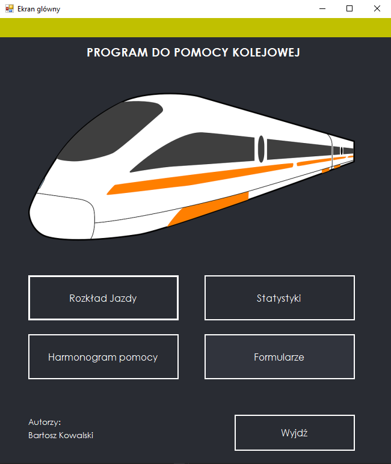
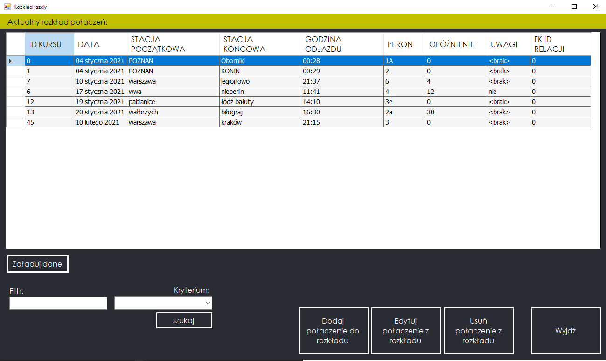
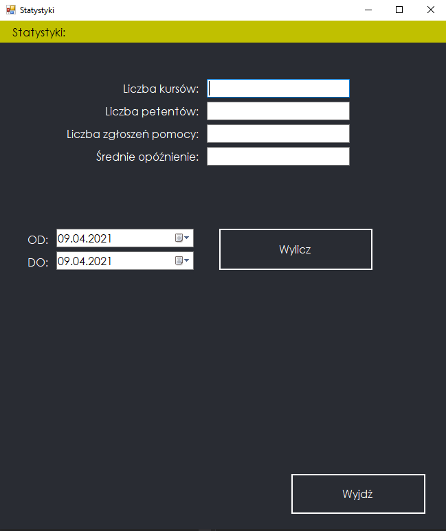
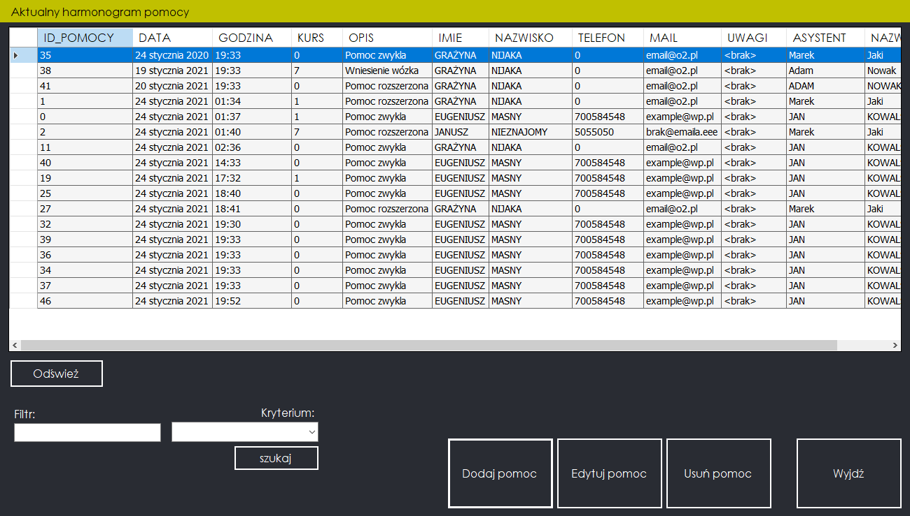

# TrainStationAssistant
The purpose of the application is to improve the management of the railway station and to help disabled people travel by trains efficiently. It is a convenient tool supporting a train station in arranging a schedule of help for people with disabilities using public transport.

## Table of contents
* [General info](#general-info)
* [Technologies](#technologies)
* [Setup](#setup)
* [Screenshots](#examples)

## General info
This application uses Oracle DB. It was made in **January 2021**.

## Technologies
C#
OracleDB
Dapper (Object-Relational Mapping)

## Setup
Clone this repository using git bash:
```
https://github.com/bartosztkowalski/TrainStationAssistant.git
```
It`s preferred to open in Visual Studio 2019.

## Screenshots
Main menu:

Timetable:

Statistics:

Help schedule:
